# 🏛️ Jharkhand Science, Technology and Innovation Portal
### *झारखंड विज्ञान, प्रौद्योगिकी और नवाचार पोर्टल*

[](https://nextjs.org/)
[](https://react.dev/)
[](https://spring.io/projects/spring-boot)
[](https://www.oracle.com/java/)
[](https://fastapi.tiangolo.com/)
[](https://tailwindcss.com/)
[](https://www.docker.com/)
[](https://redis.io/)
[](https://min.io/)

---

## 📌 Overview

The **Jharkhand Science, Technology and Innovation Portal** is an enterprise-grade digital ecosystem designed to bridge grassroots societal challenges across all 24 districts of Jharkhand with Higher Education Institutions (HEIs), research facilities, startups, and industry R&D/CSR ecosystems.

Aligned with the **National Education Policy (NEP) 2020**, the platform transforms citizen-reported community issues into funded academic capstone projects, multidisciplinary research initiatives, and commercialized technological prototypes.

---

## 🌟 Core Pillars & System Capabilities

```mermaid
flowchart LR
    A[🧑‍💼 Citizen Submission] -->|GPS, Photos, Video, Doc| B[🧠 AI Validation & Classification Engine]
    B -->|Deduplication & Capability Matching| C[🎓 University / HEI Portal]
    C -->|Capstone Team & Research Proposal| D[🏭 Industry & CSR Marketplace]
    D -->|Mentorship, Funding, Co-Dev| E[🚀 Prototype, Pilot & Field Testing]
    E -->|Deployment & Impact Metrics| F[🏛️ Government & Nodal Analytics]
```



### 1. 🧑‍💼 Citizen Engagement & Multimodal Challenge Reporting
- Citizens, Panchayati Raj Institutions (PRIs), and Urban Local Bodies (ULBs) submit local challenges.
- Supports **multimodal evidence**: geotagged photos, videos, GPS coordinates, and PDF documents.
- Real-time **Ticket Tracking** with status progression and assigned university/industry details.

### 2. 🧠 AI-Enabled Problem Management & Verification
- **Automated Domain Classification**: Education, Agriculture, Healthcare, Water Resources, Environment, Energy, Infrastructure, etc.
- **Multimodal Content Validation**: Image, video, document, and location verification layer.
- **Semantic Deduplication**: Clusters related or duplicate issues across geographic zones.
- **Intelligent HEI Routing**: Matches challenges to universities based on research expertise, labs, and faculty specializations.

### 3. 🎓 University (HEI) Collaboration Portal
- **Assigned Challenges Hub**: Review and accept AI-routed regional challenges.
- **Capstone Project Workflow**: Form multidisciplinary student-faculty teams and author solution proposals.
- **NEP 2020 & NAAC Report Card**: Automated institutional impact metrics for NAAC accreditation and NIRF ranking.
- **QR Verified Certificates**: Dynamic verifiable credential generation for student and faculty innovators.
- **Researcher & Lab Directory**: Showcase institutional IP, incubation facilities, and faculty mentors.

### 4. 🏭 Industry, Startup & CSR Co-Development Marketplace
- **Problem Marketplace**: Browse university-verified challenges filtered by district, TRL (Technology Readiness Level), and domain.
- **Active Pilots & Prototyping**: Track co-development milestones, deliverable submissions, and test results.
- **Mentorship & CSR Fund Tracker**: Log mentorship hours and monitor CSR grant disbursements against milestones.
- **IP & Technology Transfer**: Manage joint MOUs, patent filings, and licensing agreements.
- **Direct Real-Time Communication**: Integrated messaging with live cross-portal synchronized communication.

### 5. 🏛️ Government Nodal & Analytics Dashboard
- **24-District Interactive Heatmaps**: Real-time volume, urgency, and domain distribution across Jharkhand.
- **Institutional & Industry Participation**: Track university performance, project completion rates, and CSR commitments.
- **Social Impact Scorecard**: Measure real-world beneficiaries reached and deployed public infrastructure.

---

## 🏗️ Architecture & Technology Stack

| Tier | Technology | Description |
| :--- | :--- | :--- |
| **Frontend Web** | Next.js 14/15, React 19, TypeScript, Tailwind CSS v4, Zustand, Chart.js | Modern responsive web app with 5 role-based portals & real-time communication |
| **API Gateway** | Spring Cloud Gateway, Reactive WebFlux, JWT Security | Central reverse proxy, route filter, authentication forwarder, rate limiter |
| **Core Backend** | Spring Boot 3.4.x, Java 21, Spring Data JPA, Hibernate, PostgreSQL | RESTful microservice managing business logic, pilots, partnerships & submissions |
| **AI Microservice** | Python 3.11, FastAPI, PyTorch, Sentence-Transformers, gRPC | Validation, semantic classification, deduplication & HEI recommendation engine |
| **Notification Service**| Node.js / Java microservice | Real-time alert dispatch, notifications & event distribution |
| **Caching & Session** | Redis 7 (Alpine) | Session token storage, OTP caching, and rate limiting cache |
| **Object Storage** | MinIO (S3 Compatible) | Storage for evidence photos, videos, proposals, and certificates |
| **Inter-Service Comms** | gRPC / Protocol Buffers, RESTful HTTP/JSON | High-throughput low-latency microservice communication |

---

## 📁 Repository Structure

```
Social-issues/
├── api-gateway/                 # Spring Cloud API Gateway (Port 8080)
│   ├── src/main/java/           # Gateway route filters & JWT auth filter
│   └── pom.xml
├── backend/                     # Spring Boot Core Backend Service (Port 8081)
│   ├── src/main/java/           # Industry partnership, challenges, pilots, auth
│   └── pom.xml
├── ai-service/                  # Python FastAPI & AI Classification Service (Port 8000)
│   ├── app/                     # Preprocessing, categorization & routing models
│   ├── main.py
│   └── requirements.txt
├── frontend/
│   └── web/                     # Next.js 14 / React 19 Frontend Web Application (Port 3000)
│       ├── src/app/             # App Router pages (auth, industry, university, etc.)
│       ├── src/components/      # UI components, dashboard views, shared widgets
│       └── src/modules/         # State hooks, API clients, communication engine
├── notification-service/        # Notification & dispatch microservice
├── proto/                       # Protocol Buffer definitions for gRPC contracts
├── docker-compose.yml           # Redis 7 & MinIO object storage services
└── README.md                    # Project documentation
```

---

## 🚀 Getting Started

### Prerequisites

Ensure you have the following installed on your machine:
- **Java Development Kit (JDK) 21** or later
- **Node.js 20+** and **pnpm** (`npm install -g pnpm`)
- **Python 3.10+** and `pip` / `virtualenv`
- **Docker** and **Docker Compose**
- **Maven** (or use included `./mvnw`)

---

### Step 1: Start Infrastructure (Redis & MinIO)

Run the supporting database, cache, and object storage containers:

```bash
docker compose up -d
```

- **Redis**: `localhost:6379`
- **MinIO S3 API**: `http://localhost:9000`
- **MinIO Console**: `http://localhost:9001` *(Default credentials: `minioadmin` / `minioadmin`)*

---

### Step 2: Start the API Gateway

```bash
cd api-gateway
./mvnw spring-boot:run
```
> Gateway runs on: **`http://localhost:8080`**

---

### Step 3: Start the Backend Service

```bash
cd backend
./mvnw spring-boot:run
```
> Backend runs on: **`http://localhost:8081`**

---

### Step 4: Start the AI Service

```bash
cd ai-service
python -m venv venv
# On Windows:
.\venv\Scripts\activate
# On Linux/macOS:
source venv/bin/activate

pip install -r requirements.txt
python main.py
```
> AI Service runs on: **`http://localhost:8000`**

---

### Step 5: Start the Frontend Web Application

```bash
cd frontend/web
pnpm install
pnpm run dev
```
> Web Application runs on: **`http://localhost:3000`**

---

## 🌐 Port Mapping & Services Summary

| Service | Protocol / Port | Purpose |
| :--- | :--- | :--- |
| **Web Frontend** | `http://localhost:3000` | Next.js citizen, university, industry & government portals |
| **API Gateway** | `http://localhost:8080` | Reverse proxy, route dispatching & JWT authentication |
| **Core Backend API** | `http://localhost:8081` | Spring Boot business logic, database JPA & REST API |
| **AI Engine API** | `http://localhost:8000` | Validation, classification & HEI routing |
| **MinIO S3 API** | `http://localhost:9000` | Evidence file and document object storage |
| **MinIO Console** | `http://localhost:9001` | S3 storage administration web dashboard |
| **Redis Cache** | `localhost:6379` | Fast key-value session cache & rate limiting |

---

## 🧪 Testing & Code Quality

### Frontend Typecheck & Lint
```bash
cd frontend/web
pnpm run lint
npx tsc --noEmit --skipLibCheck
```

### Backend Build & Unit Tests
```bash
cd backend
./mvnw clean test
```

### API Gateway Build & Tests
```bash
cd api-gateway
./mvnw clean test
```

---

## 👥 Role-Based Demo Credentials

For demonstration and testing purposes, role-specific accounts can be created or accessed directly via portal login:

| Role | Portal Route | Primary Features |
| :--- | :--- | :--- |
| **Citizen** | `/auth/login` | Challenge submission with evidence, ticket tracker |
| **University (HEI)** | `/auth/login/university` | Assigned challenges, Capstone projects, NEP 2020 / NAAC scorecard |
| **Industry / CSR** | `/auth/login/industry` | Problem marketplace, active pilots, CSR funding, live messaging |
| **Government Nodal** | `/auth/login/government` | District heatmaps, cross-department analytics, institutional metrics |

---

## 📜 License & Compliance

This project is developed for the **Government of Jharkhand Science, Technology and Innovation Initiative**, aligned with **NEP 2020** guidelines for academic innovation and experiential societal learning.

---

<div align="center">
  <sub>Built with ❤️ for Jharkhand Innovation Ecosystem | National Education Policy (NEP) 2020 Aligned</sub>
</div>
