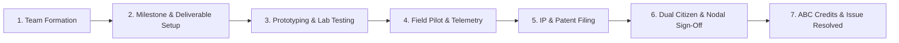

# 📋 Project Lifecycle Management System — Actionable Task Breakdown

**Platform**: Societal Innovation Collaboration Portal — Jharkhand  
**Module**: Project Lifecycle Management, Milestones, Deliverables, Approvals, Testing, IP & Closed-Loop Validation  
**Target Architecture**: Spring Boot Backend (`projectlifecycle` package), Next.js Frontend (`modules/university`, `components/dashboard`)

---

## 🎯 System Scope & Objectives

Implement an end-to-end lifecycle tracking system that takes a societal challenge from **University Team Formation** through **Milestone Tracking**, **Deliverables Verification**, **Prototyping & Field Testing**, **Intellectual Property (IP) Registration**, **CSR Milestone Funding**, and **Closed-Loop Citizen & Government Sign-Off**.

---

## 🧱 Phase 1: Backend Domain Models & Database Schema

### [x] Task 1.1 — Create Unified `ProjectMilestone` & `ProjectDeliverable` Entities
- **Location**: `backend/src/main/java/com/example/social_issues/projectlifecycle/model/`
- **Fields for `ProjectMilestone`**:
  - `id`: Long (PK)
  - `projectId`: Long (FK to `UniversityProject` / `CoFundedPilot`)
  - `milestoneNumber`: Integer (1, 2, 3, 4...)
  - `title`: String (e.g., "TRL-4 Lab Prototype Demonstration")
  - `deliverableSummary`: String (Text description)
  - `targetDate`: LocalDate
  - `completedDate`: LocalDate (Nullable)
  - `status`: Enum (`UPCOMING`, `IN_PROGRESS`, `SUBMITTED_FOR_REVIEW`, `APPROVED`, `REVISION_REQUESTED`)
  - `trancheAmount`: BigDecimal (Grant disbursement tied to this milestone)
  - `completionPercentage`: Integer (0–100%)
  - `deliverables`: List of `ProjectDeliverable`
- **Fields for `ProjectDeliverable`**:
  - `id`: Long (PK)
  - `milestoneId`: Long (FK)
  - `title`: String (e.g., "IoT Telemetry Firmware v1.0", "CAD Enclosure Blueprint")
  - `deliverableType`: Enum (`HARDWARE_SCHEMATIC`, `SOURCE_CODE_REPO`, `LAB_REPORT`, `FIELD_TEST_DATA`, `VIDEO_DEMO`, `USER_MANUAL`)
  - `fileStorageKey` / `fileUrl`: String (S3/MinIO upload link)
  - `submittedByUserId`: Long
  - `isApproved`: Boolean
  - `reviewNotes`: String

---

### [x] Task 1.2 — Create `IntellectualPropertyRecord` & Patent Model
- **Location**: `backend/src/main/java/com/example/social_issues/projectlifecycle/model/`
- **Fields for `IntellectualPropertyRecord`**:
  - `id`: Long (PK)
  - `projectId`: Long (FK)
  - `title`: String (e.g., "Solar-Powered Microbial Water Filtration Unit")
  - `ipType`: Enum (`OPEN_SOURCE`, `SHARED_PATENT`, `COMMERCIAL_LICENSE`, `COPYRIGHT_SOFTWARE`)
  - `patentApplicationNumber`: String (Nullable until filed)
  - `filingDate`: LocalDate
  - `patentOffice`: String (e.g., "Indian Patent Office (IPO) Kolkata", "WIPO/PCT")
  - `status`: Enum (`IDEA_DISCLOSURE`, `PRIOR_ART_SEARCH`, `PROVISIONAL_FILED`, `COMPLETE_SPEC_FILED`, `PUBLISHED`, `EXAMINATION`, `GRANTED`, `COMMERCIALLY_LICENSED`)
  - `heiOwnershipShare`: Integer (Percentage, e.g., 50%)
  - `studentInnovatorsShare`: Integer (Percentage, e.g., 30%)
  - `industryPartnerShare`: Integer (Percentage, e.g., 20%)
  - `inventorNamesJson`: String / JSON (List of faculty mentors & student innovators)
  - `mouDocumentStorageKey`: String
  - `royaltyTerms`: String (Text)

---

### [x] Task 1.3 — Create `ProjectTestResult` & Field Telemetry Model
- **Location**: `backend/src/main/java/com/example/social_issues/projectlifecycle/model/`
- **Fields for `ProjectTestResult`**:
  - `id`: Long (PK)
  - `projectId`: Long (FK)
  - `testType`: Enum (`LAB_BENCHMARK`, `SIMULATION`, `SANDBOX_PILOT`, `DISTRICT_FIELD_TRIAL`, `SAFETY_COMPLIANCE`)
  - `trlLevel`: Integer (1 to 9 scale)
  - `testLocation`: String (e.g., "Block Angara, Ranchi District")
  - `testDate`: LocalDate
  - `testedBy`: String
  - `parametersJson`: String / JSON (e.g., `{"turbidity_reduction_percent": 94.2, "flow_rate_lph": 150}`)
  - `passStatus`: Enum (`PASSED`, `FAILED`, `CONDITIONALLY_PASSED`, `UNDER_EVALUATION`)
  - `observations`: String (Text)
  - `evidenceAttachmentUrl`: String

---

### [x] Task 1.4 — Create `StageApprovalSignoff` & Dual Closed-Loop Model
- **Location**: `backend/src/main/java/com/example/social_issues/projectlifecycle/model/`
- **Fields for `StageApprovalSignoff`**:
  - `id`: Long (PK)
  - `projectId`: Long (FK)
  - `stage`: Enum (`PROPOSAL`, `PROTOTYPE`, `FIELD_PILOT`, `DEPLOYMENT_HANDOVER`, `FINAL_RESOLUTION`)
  - `approverRole`: Enum (`FACULTY_MENTOR`, `HEI_DEAN_SPOC`, `INDUSTRY_CSR_ADMIN`, `CITIZEN_REPORTER`, `NODAL_GOVT_OFFICER`)
  - `approverUserId`: Long
  - `approverName`: String
  - `approvalStatus`: Enum (`APPROVED`, `REJECTED`, `CHANGES_REQUESTED`, `WAIVED_BY_ADMIN`)
  - `digitalSignatureHash`: String (SHA-256 integrity hash)
  - `citizenRating`: Integer (1–5 scale, for citizen sign-off)
  - `closureCertificateStorageKey`: String (PDF generated for PRI/ULB nodal sign-off)
  - `signedAt`: LocalDateTime

---

### [-] Task 1.5 — ABC Credit Data Model (Simplified for MVP / Optional)
- *Note: Full PDF generator and DigiLocker sync deferred beyond core SIH MVP. Student ABC credits are tracked directly on `UniversityTeamMember.abcCredits` upon closed-loop project resolution.*

---

## ⚙️ Phase 2: Service Layer & Business Logic

### [ ] Task 2.1 — Implement `ProjectLifecycleService`
- **Location**: `backend/src/main/java/com/example/social_issues/projectlifecycle/service/impl/ProjectLifecycleServiceImpl.java`
- **Capabilities**:
  - `createMilestoneRoadmap(Long projectId, List<MilestoneRequest> milestones)`
  - `submitDeliverable(Long milestoneId, DeliverableUploadRequest request, Long submitterId)`
  - `reviewMilestone(Long milestoneId, MilestoneReviewRequest review, Long reviewerId)`
  - `advanceProjectStage(Long projectId, StageTransitionRequest request, Long actorUserId)`
  - `recordFieldTestOutcome(Long projectId, TestResultRequest request)`
  - `fileIntellectualProperty(Long projectId, IpRegistrationRequest request)`
  - `submitDualSignoff(Long projectId, ClosedLoopSignoffRequest signoff)`

---

### [ ] Task 2.2 — Enforce Closed-Loop Issue Transition Logic
- When `FINAL_RESOLUTION` stage receives both:
  1. Citizen feedback/rating (or 14-day documented waiver).
  2. Nodal Officer (PRI/ULB) digital closure certificate.
- **Auto-Actions**:
  - Transition `GrassrootIssue.status` from `ASSIGNED_HEI` / `IN_PROGRESS` → `RESOLVED`.
  - Record `resolvedAt` timestamp.
  - Auto-generate `AbcCreditCertificate` for all registered student innovators on the project.
  - Push notification to Citizen, HEI SPOC, Faculty, Industry Sponsor, and Government Dashboard.

---

## 🌐 Phase 3: REST API Controllers & Gateway Routing

### [ ] Task 3.1 — Create `ProjectLifecycleController`
- **Location**: `backend/src/main/java/com/example/social_issues/projectlifecycle/controller/ProjectLifecycleController.java`
- **Routes**:
  - `GET /api/projects/{projectId}/lifecycle` — Get full project lifecycle summary (milestones, deliverables, tests, IP, sign-offs).
  - `POST /api/projects/{projectId}/milestones` — Create or batch-update milestone roadmap.
  - `POST /api/projects/{projectId}/milestones/{milestoneId}/deliverables` — Upload deliverable file/link.
  - `PATCH /api/projects/{projectId}/milestones/{milestoneId}/review` — Approve/reject milestone.
  - `POST /api/projects/{projectId}/stage-advance` — Request stage transition.
  - `POST /api/projects/{projectId}/signoff` — Submit digital endorsement / closure sign-off.

---

### [ ] Task 3.2 — Create `IntellectualPropertyController`
- **Location**: `backend/src/main/java/com/example/social_issues/projectlifecycle/controller/IntellectualPropertyController.java`
- **Routes**:
  - `GET /api/projects/{projectId}/ip-records` — Fetch IP filings for this project.
  - `POST /api/projects/{projectId}/ip-records` — Record patent disclosure / application.
  - `PATCH /api/projects/{projectId}/ip-records/{ipId}/status` — Update patent examination / grant status.
  - `GET /api/ip/repository` — Platform-wide IP & Technology Transfer catalog (for Industry & Govt).

---

### [ ] Task 3.3 — Create `ProjectTestingController`
- **Location**: `backend/src/main/java/com/example/social_issues/projectlifecycle/controller/ProjectTestingController.java`
- **Routes**:
  - `GET /api/projects/{projectId}/tests` — Get all lab & field test logs.
  - `POST /api/projects/{projectId}/tests` — Log new test outcome / TRL progression.

---

## 💻 Phase 4: Frontend Dashboard Integration

### [ ] Task 4.1 — Upgrade University Dashboard: Milestones & Deliverables Roadmap
- **Location**: `frontend/web/src/components/dashboard/UniversityDashboardView.tsx`
- **UI Enhancements**:
  - Replace the single text `milestoneDesc` with an interactive **Milestone Timeline Stepper** (Milestone 1 to 4).
  - Deliverable submission card: Drag-and-drop file upload for CAD files, code repo URLs, and test data PDFs.
  - Status badges: `Upcoming`, `In Progress`, `Under Review`, `Approved`, `Revision Needed`.

---

### [ ] Task 4.2 — Implement Industry Dashboard: IP & Technology Transfer Tab
- **Location**: `frontend/web/src/components/dashboard/IndustryDashboardView.tsx`
- **UI Enhancements**:
  - Replace `WorkspacePlaceholderTab` under `activeTab === "ip"` with a full **IP & Tech Transfer Hub**:
    - List of Co-Owned Patents & Copyrights across funded university projects.
    - Tripartite ownership percentage breakdown visualizer (Pie / Progress bar).
    - Status pill (`Provisional Filed`, `Published`, `Granted`, `Commercial License`).
    - Action buttons: "Download Standard MOU", "Request Tech Transfer Licensing Call".

---

### [ ] Task 4.3 — Implement Prototyping & Testing Tab in Industry Dashboard
- **Location**: `frontend/web/src/components/dashboard/industry/ActivePilotsTab.tsx`
- **UI Enhancements**:
  - TRL level slider (TRL 1 to TRL 9) with criteria checklists.
  - Field pilot telemetry dashboard: Sensor readings, testbed district locations, pass/fail metrics.
  - One-click milestone sign-off for CSR grant tranche release.

---

### [ ] Task 4.4 — Dual Closed-Loop Sign-Off Modal (Citizen & PRI/ULB Nodal Officer)
- **Location**:
  - `frontend/web/src/components/dashboard/CitizenDashboardView.tsx`
  - `frontend/web/src/components/dashboard/GovernmentDashboardView.tsx`
- **UI Enhancements**:
  - Citizen: "Confirm Solution Deployment" modal with 5-star rating, review comments, and optional photo upload.
  - Nodal Officer: "Issue Digital Completion Certificate" modal with department seal, digital signature confirmation, and jurisdiction endorsement.

---

### [ ] Task 4.5 — NEP 2020 ABC Credit Certificate Viewer & PDF Generator
- **Location**: `frontend/web/src/components/dashboard/UniversityDashboardView.tsx`
- **UI Enhancements**:
  - Dedicated "ABC Credit Passbook" tab/card for students and faculty mentors.
  - Printable/Downloadable PDF Certificate containing QR code verification hash, student roll number, hours logged, and university accreditation endorsements.

---

## 🧪 Phase 5: Verification & Quality Assurance

- [ ] **Automated Build**: Ensure `./mvnw compile` and `pnpm build` pass with 0 errors.
- [ ] **Milestone Flow Test**: Create a project → add 3 milestones → upload deliverable → approve → release tranche.
- [ ] **IP Lifecycle Test**: File provisional patent disclosure → verify ownership splits → check display in Industry portal.
- [ ] **Closed-Loop Resolution Test**: Complete project → citizen rates 5 stars → nodal officer signs off → verify `GrassrootIssue` moves to `RESOLVED` and ABC credits are awarded.
