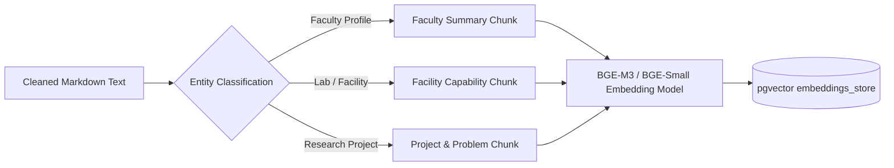

# 🏛️ University Intelligent Pipeline, Crawler & Knowledge Graph Blueprint

**Target Focus:** 12 Premier Higher Education Institutions (HEIs) in Jharkhand  
**Architecture:** Safe Async Crawler $\rightarrow$ Clean Text Parsing $\rightarrow$ LangGraph Extraction $\rightarrow$ BGE-M3 Embeddings + Hybrid Search $\rightarrow$ Multi-Dimensional University Routing  
**Database:** Supabase PostgreSQL with `pgvector` & Relational Capability Graph  

---

## 🗺️ 1. Target Jharkhand Universities (The 12 Knowledge Base Nodes)

| Code | University / Institution | Location | Focus / Core Excellence Domains | Official Portal |
| :--- | :--- | :--- | :--- | :--- |
| `IIT_ISM_DHANBAD` | IIT (ISM) Dhanbad | Dhanbad | Mining, Earth Sciences, Environmental Engg, Robotics | `https://www.iitism.ac.in` |
| `BIT_MESRA` | Birla Institute of Technology (BIT) Mesra | Ranchi | Space Engg, Computer Science, Water Resources, BioTech | `https://www.bitmesra.ac.in` |
| `NIT_JAMSHEDPUR` | NIT Jamshedpur | Jamshedpur | Manufacturing, Metallurgical, Civil & Structural Engg | `https://www.nitjsr.ac.in` |
| `BAU_RANCHI` | Birsa Agricultural University | Ranchi | Agronomy, Soil Science, Horticulture, Veterinary, Irrigation | `https://www.bauranchi.org` |
| `CUJ_RANCHI` | Central University of Jharkhand | Ranchi | Renewable Energy, Tribal Studies, Water Tech, Nanotech | `https://www.cuj.ac.in` |
| `IIIT_RANCHI` | Indian Institute of Information Tech | Ranchi | AI/ML, Embedded IoT, Cyber Security, Data Science | `https://iiitranchi.ac.in` |
| `AIIMS_DEOGHAR` | AIIMS Deoghar | Deoghar | Rural Healthcare, Public Health, Clinical Diagnostics, Telemedicine | `https://www.aiimsdeoghar.edu.in` |
| `XLRI_JAMSHEDPUR` | XLRI Xavier School of Management | Jamshedpur | Social Entrepreneurship, Public Policy, Rural Management | `https://www.xlri.ac.in` |
| `RANCHI_UNIV` | Ranchi University | Ranchi | Pure Sciences, Economics, Regional Development, Tribal Languages | `https://www.ranchiuniversity.ac.in` |
| `VBU_HAZARIBAGH` | Vinoba Bhave University | Hazaribagh | Life Sciences, Geology, Rural Development | `https://www.vbu.ac.in` |
| `KOLHAN_UNIV` | Kolhan University | Chaibasa | Forestry, Botany, Mineral Resources, Community Health | `https://www.kolhanuniversity.ac.in` |
| `BBMKU_DHANBAD` | Binod Bihari Mahto Koyalanchal Univ | Dhanbad | Coal Resource Management, Environmental Chemistry | `https://bbmku.ac.in` |

---

## ⚙️ 2. Crawler Pipeline Architecture (`ai-service`)

### 2.1 Component Structure
```text
ai-service/
├── app/
│   ├── infrastructure/
│   │   └── crawler/
│   │       ├── ssrf.py           # Strict Private IP / Loopback / Cloud metadata protection
│   │       ├── robots.py         # Politeness parser & Rate-limit compliance (Crawl-Delay)
│   │       ├── normalizer.py     # Canonical URL normalization & deduplication
│   │       ├── sitemap.py        # XML sitemap discovery & URL filtering
│   │       ├── client.py         # Async httpx client with backoff & User-Agent rotation
│   │       ├── parser.py         # Trafilatura + BeautifulSoup semantic text/HTML extractor
│   │       ├── hash.py           # SHA-256 + Content-Hash change detection
│   │       ├── storage.py        # Supabase/PostgreSQL atomic page & snapshot persistence
│   │       ├── engine.py         # Async BFS/DFS selective crawler engine
│   │       └── scheduler.py      # Background crawl job orchestrator
│   ├── services/
│   │   └── crawl_service.py      # High-level trigger, status, and metrics service
│   └── api/
│       └── crawl.py              # REST endpoints (/api/v1/crawl/trigger, /status, /universities)
├── database/
│   ├── migrations/
│   │   └── 003_crawler_schema.sql # crawl_configurations, crawl_targets, crawled_pages
│   └── seed/
│       └── crawl_configuration_seed.py # Seed rules for all 12 Jharkhand universities
└── scripts/
    └── crawl_university.py       # CLI runner for single or batch university crawling
```

---

## 🎯 3. High-Value Pattern Targeting (Selective Crawling)

To prevent crawling irrelevant pages (e.g., fee payment, tenders, exam schedules, seat allotments), the crawler implements strict **Inclusion** and **Exclusion** rules:

### Priority Inclusion Target Patterns:
- **Faculty Profiles:** `/faculty/.*`, `/people/.*`, `/faculty-profile/.*`, `/professors/.*`, `/staff/.*`
- **Departments:** `/department/.*`, `/dept/.*`, `/academic/departments/.*`, `/schools/.*`
- **Research Facilities & Labs:** `/research/.*`, `/facilities/.*`, `/laboratories/.*`, `/centres/.*`, `/equipment/.*`
- **Innovation & Incubation:** `/incubation/.*`, `/tbi/.*`, `/startup/.*`, `/innovation/.*`, `/edc/.*`
- **Projects & Publications:** `/projects/.*`, `/sponsored-research/.*`, `/patents/.*`, `/publications/.*`

### Exclusion Reject Patterns:
- `.*(tender|admission|fee|fee-structure|result|hall-ticket|alumni-donation|sports|placement-record|convocation|login|register|pdf).*`

---

## 📦 4. Database Schema (`003_crawler_schema.sql`)

### Key Tables:
1. `crawl_configurations`:
   - `university_id`, `base_url`, `allowed_domains`, `max_depth` (default 3), `crawl_delay_seconds` (1–3s), `max_pages` (500–1000), `sitemap_url`, `status`.
2. `crawl_targets`:
   - Specific designated starting seed URLs per institution (e.g., `https://bitmesra.ac.in/faculty-directory`, `https://www.iitism.ac.in/depts/environmental-science`).
3. `crawled_pages`:
   - `id`, `university_id`, `url`, `canonical_url`, `page_type` (`FACULTY`, `DEPARTMENT`, `FACILITY`, `RESEARCH_CENTRE`, `INCUBATION`, `OTHER`),
   - `raw_html_compressed` / `raw_html_storage_path`,
   - `clean_text` (markdown extracted via Trafilatura),
   - `content_hash` (SHA-256), `etag`, `last_modified`, `http_status`,
   - `extraction_status` (`PENDING`, `EXTRACTED`, `FAILED`),
   - `crawled_at`, `updated_at`.

---

## 🧠 5. Embeddings & Vector Storage Strategy

### 💡 Should we embed the crawled dataset?
**YES, absolutely.** But with intelligent tiered chunking:



### Chunking Strategy:
- **Faculty Chunks (256–512 tokens):** Name, Department, Research Keywords, Selected Publications, Patents, Bio.
- **Facility Chunks (256–512 tokens):** Equipment Name, Testing Methods, Analytical Capabilities, Relevant Domains.
- **Department/Centre Chunks (512 tokens):** Core Areas, Ongoing Sponsored Schemes, Collaborations.

### Hybrid Search Formula:
$$\text{Final Score} = \alpha \cdot \text{Vector Cosine Similarity} + \beta \cdot \text{BM25 Keyword Match} + \gamma \cdot \text{Graph Distance Proximity}$$

---

## 🤖 6. Step 4 Preview — LangGraph Extraction Pipeline

Once raw text is stored in `crawled_pages`, a LangGraph multi-agent pipeline extracts structured entities:

1. **Classifier Node:** Reads clean markdown $\rightarrow$ tags page type (`FACULTY`, `LAB`, `DEPARTMENT`, `GENERAL`).
2. **Faculty Extractor Node:** Extracts `{name, designation, email, phone, phd_status, specialization_keywords, source_url}` using `PydanticAI` / `Instructor`.
3. **Facility Extractor Node:** Extracts `{facility_name, equipment_list, testing_capabilities, associated_centre}`.
4. **Ontology Linker Node:** Maps extracted keywords to `expertise_taxonomy` nodes.
5. **Evidence Claim Generator:** Generates verifiable claim with `{extracted_snippet, source_url, confidence_score}`.

---

## 🏛️ 7. Full Roadmap Execution Matrix

```text
┌─────────────────────────────────────────────────────────────────────────┐
│ Step 1: Database Foundation (Supabase)                        [100% ✅] │
├─────────────────────────────────────────────────────────────────────────┤
│ Step 2: Capability & Expertise Taxonomy                       [100% ✅] │
├─────────────────────────────────────────────────────────────────────────┤
│ Step 3: Safe University Crawler Engine                        [IN PLAN] │
│   3.1 - Core Crawler (SSRF, robots.txt, Trafilatura, Hashes)            │
│   3.2 - 003_crawler_schema.sql & 12 Jharkhand Univ Seeds                │
│   3.3 - High-Value Target Crawling & Snapshot DB Storage                │
├─────────────────────────────────────────────────────────────────────────┤
│ Step 4: LangGraph Extraction & Structured Mapping             [NEXT]    │
├─────────────────────────────────────────────────────────────────────────┤
│ Step 5: Verification & Confidence Scoring                     [NEXT]    │
├─────────────────────────────────────────────────────────────────────────┤
│ Step 6: BGE-M3 Embeddings + pgvector Hybrid Search            [NEXT]    │
├─────────────────────────────────────────────────────────────────────────┤
│ Step 7: Dual-Closed-Loop University Routing Engine            [FINAL]   │
└─────────────────────────────────────────────────────────────────────────┘
```
