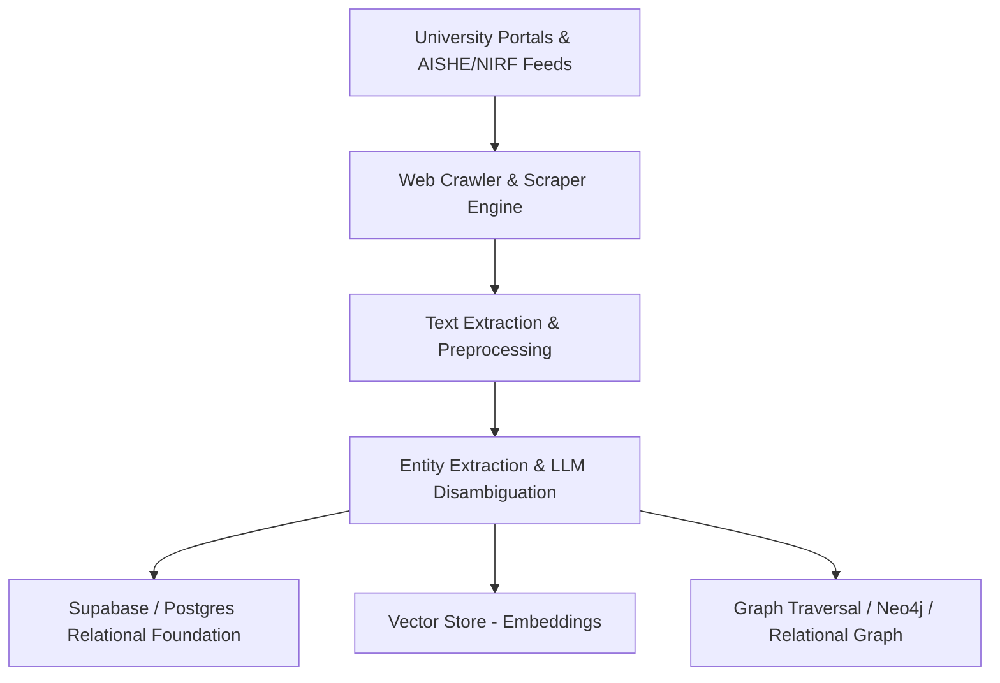

# 🧠 University Knowledge Base, Knowledge Graph & Recommendation Engine Architecture

**Status:** Ready for Crawler Ingestion & Knowledge Graph Construction  
**Components:**
1. **Academic Web Crawler & Pipeline:** Ingests live university portals, departmental directories, faculty profiles, research publications, and lab facilities.
2. **Knowledge Graph (KG) Construction:** Builds semantic entities and relationships (Institutions $\rightarrow$ Departments $\rightarrow$ Faculty $\rightarrow$ Specializations $\rightarrow$ Research Facilities & Projects).
3. **AI Recommendation & Routing Engine:** Maps incoming societal issues / problem statements to the most qualified academic teams, equipment, and innovation centres using embeddings + KG traversal.

---

## 🏗️ 1. Ingestion Pipeline & Crawler Architecture



### Entity Schema
- **Institutions (`universities`):** Code, AISHE ID, official domain, GPS coordinates, quota limits.
- **Departments (`departments`):** Department codes, faculty roster links, sub-domains.
- **Faculty (`faculty`):** Verified academic email, designations, research focus, PhD credentialing.
- **Research & Innovation Infrastructure (`facilities`, `research_centres`, `incubation_centres`):** Lab equipment capabilities, patents, active incubatees.
- **Evidence Verification (`evidence_claims`):** Source URLs, confidence scores, and factual validation stamps.

---

## 🔍 2. Knowledge Graph Topology

```
[University Node]
       │
       ├──► [Department Node] ──► [Faculty Member Node]
       │                                  │
       │                                  ▼
       │                          [Expertise / Taxonomy Node]
       │                                  ▲
       ├──► [Research Centre Node]        │
       │           │                      │
       │           ▼                      │
       └──► [Lab Facility Node] ──────────┘
```

---

## 🎯 3. Problem-to-University Recommendation Workflow

1. **Problem Analysis:** Citizen or Government issue processed by FastAPI AI Service (categorization, domain tagging, geocoding).
2. **Hybrid Semantic Matching:**
   - **Vector Search:** Matches issue text against faculty publication embeddings and lab capability snippets.
   - **Graph Traversal:** Traverses from matching taxonomy nodes to find closest faculty, active departments, and regional institutions.
3. **Dynamic Routing:** Factors in regional proximity (Jharkhand districts), capacity quotas (`max_active_challenges`), and verified laboratory facilities.
